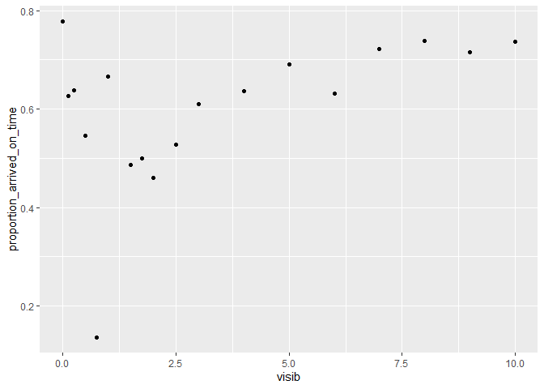

Homework 2
================
Justin Li
2022-10-08

What time of day should you fly if you want to avoid delays as much as
possible? Does this choice depend on anything? Season? Weather? Airport?
Airline? Find three patterns (“null results” are ok!). Write your
results into Rmarkdown. Include a short introduction that summarizes the
three results. Then, have a section for each finding. Support each
finding with data summaries and visualizations. Include your code when
necessary.

``` r
flights %>%
  mutate(on_time = if_else(condition = arr_delay <= 0,
                           true = T,
                           false = F,
                           missing = F)) %>%
  group_by(hour) %>%
  summarise(proportion_arrived_on_time = mean(on_time),
            number_flights = n()) %>%
  arrange(desc(proportion_arrived_on_time)) 
```

    ## # A tibble: 20 × 3
    ##     hour proportion_arrived_on_time number_flights
    ##    <dbl>                      <dbl>          <int>
    ##  1     7                      0.717          22821
    ##  2     5                      0.705           1953
    ##  3     6                      0.692          25951
    ##  4     8                      0.658          27242
    ##  5     9                      0.649          20312
    ##  6    11                      0.638          16033
    ##  7    10                      0.633          16708
    ##  8    12                      0.604          18181
    ##  9    13                      0.572          19956
    ## 10    14                      0.554          21706
    ## 11    16                      0.517          23002
    ## 12    15                      0.508          23888
    ## 13    18                      0.498          21783
    ## 14    17                      0.495          24426
    ## 15    22                      0.493           2639
    ## 16    19                      0.489          21441
    ## 17    20                      0.482          16739
    ## 18    23                      0.471           1061
    ## 19    21                      0.457          10933
    ## 20     1                      0                  1

If you want to avoid delays as much as possible, you should fly at 7 am
as it has the highest proportion of flights that arrived on time.

## Airlines

``` r
flights %>%
  left_join(airlines, by = "carrier") %>%
  filter(hour == 7) %>%
  mutate(on_time = if_else(condition = arr_delay <= 0,
                           true = T,
                           false = F,
                           missing = F)) %>%
  group_by(name) %>%
  summarise(proportion_arrived_on_time = mean(on_time),
            number_flights = n()) %>%
  arrange(desc(proportion_arrived_on_time))
```

    ## # A tibble: 13 × 3
    ##    name                        proportion_arrived_on_time number_flights
    ##    <chr>                                            <dbl>          <int>
    ##  1 Frontier Airlines Inc.                           1                  1
    ##  2 Alaska Airlines Inc.                             0.819            349
    ##  3 Virgin America                                   0.774            973
    ##  4 Endeavor Air Inc.                                0.761            628
    ##  5 American Airlines Inc.                           0.758           3348
    ##  6 Delta Air Lines Inc.                             0.758           3787
    ##  7 Southwest Airlines Co.                           0.725           1351
    ##  8 United Air Lines Inc.                            0.716           4460
    ##  9 US Airways Inc.                                  0.716            912
    ## 10 JetBlue Airways                                  0.679           3588
    ## 11 ExpressJet Airlines Inc.                         0.651           2370
    ## 12 Envoy Air                                        0.602            992
    ## 13 AirTran Airways Corporation                      0.532             62

As shown in the chart above, the airlines does seem to indicate your
likelihood of arriving on time. For example, American Airlines had a
75.8% proportion of flights that arrived on time while still having a
total of 3348 flights. On the other hand ExpressJet Airlines had a 65.1%
proportion of flights that arrived on time while having a total of 2370
flights. This seems to indicate that certain airlines are better than
others in terms of proportion of flights that arrived on time.
Therefore, you should choose carefully about the airline when flying out
at 7 am.

## Origin Airport

``` r
flights %>%
  left_join(airports, by = c("origin" = "faa")) %>%
  filter(hour == 7) %>%
  mutate(on_time = if_else(condition = arr_delay <= 0,
                           true = T,
                           false = F,
                           missing = F)) %>%
  group_by(name) %>%
  summarise(proportion_arrived_on_time = mean(on_time),
            number_flights = n()) %>%
  arrange(desc(proportion_arrived_on_time)) 
```

    ## # A tibble: 3 × 3
    ##   name                proportion_arrived_on_time number_flights
    ##   <chr>                                    <dbl>          <int>
    ## 1 La Guardia                               0.729           7137
    ## 2 John F Kennedy Intl                      0.719           7026
    ## 3 Newark Liberty Intl                      0.706           8658

As New York only has 3 airports, and each have a very similar proportion
of flights that arrived on time, there seems to be no relationship
between the origin airport and proportion of flights that arrived on
time. Therefore, your choice of which airport to fly out of doesn’t do
anything to improve the odds of you arriving on time at 7 am.

## Weather (visibility)

``` r
flights %>%
  left_join(weather, by = c("year", "month", "day", "hour", "origin")) %>%
  filter(hour == 7) %>%
  mutate(on_time = if_else(condition = arr_delay <= 0,
                           true = T,
                           false = F,
                           missing = F)) %>%
  group_by(visib) %>%
  summarise(proportion_arrived_on_time = mean(on_time),
            number_flights = n()) %>%
  ggplot(aes(visib, proportion_arrived_on_time)) + geom_point()
```

    ## Warning: Removed 1 rows containing missing values (geom_point).

<!-- -->

There seems to be a relationship between visibility and proportion of
flights that arrived on time, if we ignore the data less than visibility
of 1.25 miles. It seems like as the visibility increases, the better the
proportion. Therefore, even at the 7 am, you’ll want to fly when the
visibility is high.
